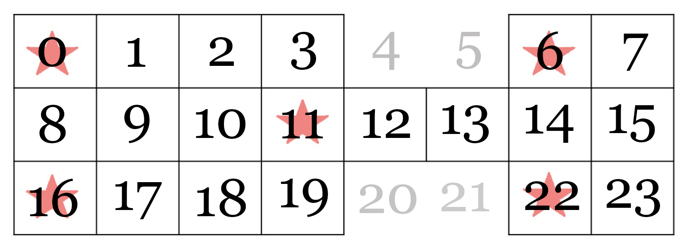

# Royal Game of Ur


## Introduction

The Royal Game of Ur, also known as the Game of Twenty Squares, is one of the oldest known board games, dating back to around 2600 BCE. This project implements a digital version of this ancient game, complete with a command-line interface and a robust state machine design.

## Features

- Faithful implementation of the Royal Game of Ur rules
- Command-line interface for easy gameplay
- Robust state machine design for game logic
- AI opponent with configurable strategies
- Comprehensive test suite
- Colorized output for enhanced user experience
- Simulation mode for running multiple games with different strategies

## Getting Started

### Prerequisites

This project was developed on a Mac (specifically an M1 Mac). Users on different operating systems may need to adapt these instructions to their environment.

Before you begin, make sure you have the following installed:

1. **Homebrew**: If you don't have Homebrew installed, run the following command in your terminal:

   ```
   /bin/bash -c "$(curl -fsSL https://raw.githubusercontent.com/Homebrew/install/HEAD/install.sh)"
   ```

   After installation, make sure to follow the instructions in the terminal to add Homebrew to your PATH.

2. **Git**: Install Git using Homebrew:
   
   ```
   brew install git
   ```

3. **asdf**: Install asdf using Homebrew:

   ```
   brew install asdf
   ```

   After installation, add the following to your `~/.zshrc` or `~/.bash_profile`:

   ```
   echo -e "\n. $(brew --prefix asdf)/libexec/asdf.sh" >> ~/.zshrc
   ```

   Then, restart your terminal or run `source ~/.zshrc`.

### Installation

1. Clone the repository:
   ```
   git clone https://github.com/yourusername/royal-game-of-ur.git
   cd royal-game-of-ur
   ```

2. Initialize the project:
   ```
   just init
   ```

   This command will:
   - Set up asdf and install required plugins and versions
   - Install necessary tools (including nbb and GraalVM)
   - Set up Git hooks
   - Install project dependencies
   - Perform any other necessary initialization steps

## Development

This project uses `just` as a command runner. To see all available commands, run:

```
just
```

Some useful commands include:

- `just cli`: Run the application
- `just watch`: Run unit tests and watch for changes
- `just test`: Run unit tests
- `just fmt`: Format Clojure files
- `just concat`: Concatenate all project files
- `just state-diagram`: Generate the state diagram
- `just sim`: Run a simulation with custom parameters
- `just build`: Build the project (creates uberjar and native image)

To update all tools to their latest versions:

```
just update-tools
```

## Usage

To start a new game:

```
just cli
```

This will launch the game in your terminal. Follow the on-screen instructions to play.

To run a simulation of multiple games with different strategies:

```
just sim [num_games] [strategy_a] [strategy_b] [debug] [show] [delay]
```

For example:
```
just sim 1000 strategic random true false 0
```

## Game Rules

1. The game is played on a board with 20 squares arranged in three rows.
2. Each player has 7 pieces that they need to move from their starting position, across the board, and off the other side.
3. Players roll four tetrahedral dice to determine their move (simulated in this digital version).
4. Players can choose to either bring a new piece onto the board or move an existing piece.
5. If a player lands on an opponent's piece, that piece is captured and must start over.
6. Landing on a rosette square grants an extra turn.
7. Pieces must leave the board on an exact roll.
8. The first player to move all seven pieces off the board wins.




## Project Structure

- `src/`: Source code files
- `test/`: Test files
- `docs/`: Documentation files, including game board and state machine diagrams
- `scripts/`: Utility scripts for development
- `justfile`: Command runner file with various development tasks
- `.tool-versions`: Specifies the versions of tools used in the project

## Testing

To run the test suite:

```
just test
```

For continuous testing during development:

```
just watch
```

## Building

To build the project (create uberjar and native image):

```
just build
```

After building, you can run the game with:

```
./royal-game-of-ur
```

## Troubleshooting

If you encounter any issues during setup or running the game, please check the following:

1. Ensure all prerequisites are correctly installed in the order specified.
2. Make sure your `PATH` includes the necessary directories for the installed tools.
3. If you're using a non-Mac system, you may need to adapt some of the commands or find alternative ways to install the required tools.

If problems persist, please open an issue on the GitHub repository.

## Contributing

Contributions are welcome! Please feel free to submit a Pull Request.

## License

This project is open source and available under the [MIT License](LICENSE).