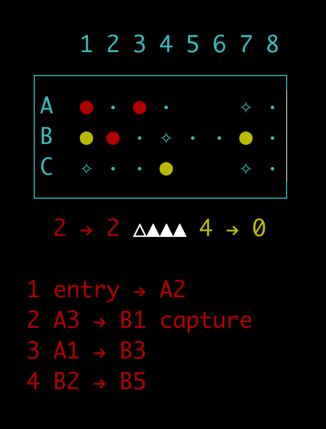

# Royal Game of Ur



## Introduction

The Royal Game of Ur, also known as the Game of Twenty Squares, is one of the oldest known board games, dating back to around 2600 BCE. This project implements a digital version of this ancient game, complete with a command-line interface, robust state machine design, and AI opponents with configurable strategies.

## Features

- Faithful implementation of the Royal Game of Ur rules
- Command-line interface for easy gameplay
- Robust state machine design for game logic
- Multiple AI opponents with configurable strategies
- Comprehensive test suite
- Colorized output for enhanced user experience
- Simulation mode for running multiple games with different strategies
- Cross-platform compatibility (Clojure and ClojureScript)

## AI Strategies

This project implements several AI strategies for playing the Royal Game of Ur:

1. **Minimax**: A powerful algorithm that looks ahead several moves, considering both its own opportunities and the opponent's potential responses. It's currently the best-performing strategy in our simulations.
2. **Monte Carlo Tree Search (MCTS)**: A probabilistic algorithm that balances exploration and exploitation to find optimal moves.
3. **Random**: Chooses moves randomly.
4. **First-in-list**: Always chooses the first available move.
5. **Strategic**: Uses a simple heuristic to prioritize moves.

You can find detailed explanations of how these algorithms work in our [AI Strategy Documentation](./docs/ai_strategies.md). For a deep dive into the Minimax algorithm, see our [Minimax Algorithm Documentation](./docs/minimax.md).

## Technologies Used

This project utilizes a variety of technologies and tools:

1. [Clojure](https://clojure.org/): A dynamic, functional programming language for the JVM
2. [ClojureScript](https://clojurescript.org/): A compiler for Clojure that targets JavaScript
3. [nbb](https://github.com/babashka/nbb): A scripting environment for ClojureScript
4. [Malli](https://github.com/metosin/malli): A data-driven schema library for Clojure(Script)
5. [core.async](https://github.com/clojure/core.async): A Clojure(Script) library for asynchronous programming
6. [JLine](https://github.com/jline/jline3): A Java library for handling console input
7. [readline-sync](https://github.com/anseki/readline-sync): A npm package for synchronous readline in Node.js
8. [just](https://github.com/casey/just): A command runner for various development tasks
9. [asdf](https://asdf-vm.com/): A version manager for multiple runtime versions
10. [yarn](https://yarnpkg.com/): A package manager for JavaScript
11. [GraalVM](https://www.graalvm.org/): A high-performance JDK distribution
12. [Graphviz](https://graphviz.org/): An open-source graph visualization software

## Getting Started

### Prerequisites

This project was developed on a Mac (M1). Users on different operating systems may need to adapt these instructions to their environment.

Before you begin, make sure you have the following installed:

1. **Homebrew**: Install with:
   ```
   /bin/bash -c "$(curl -fsSL https://raw.githubusercontent.com/Homebrew/install/HEAD/install.sh)"
   ```
   Follow the terminal instructions to add Homebrew to your PATH.

2. **Git**: Install with Homebrew:
   ```
   brew install git
   ```

3. **asdf**: Install with Homebrew:
   ```
   brew install asdf
   ```
   Add to your `~/.zshrc` or `~/.bash_profile`:
   ```
   echo -e "\n. $(brew --prefix asdf)/libexec/asdf.sh" >> ~/.zshrc
   ```
   Restart your terminal or run `source ~/.zshrc`.

### Installation

1. Clone the repository:
   ```
   git clone https://github.com/yourusername/royal-game-of-ur.git
   cd royal-game-of-ur
   ```

2. Initialize the project:
   ```
   just init
   ```

   This command will:
   - Set up asdf and install required plugins and versions
   - Install necessary tools (including GraalVM, Clojure, Node.js, nbb and Yarn)
   - Set up Git hooks
   - Install project dependencies
   - Perform any other necessary initialization steps

## Development

This project uses `just` as a command runner. To see all available commands, run:

```
just
```

Key commands include:

- `just run`: Run the CLI application (using nbb)
- `just run-clj`: Run the CLI application (using Clojure)
- `just test`: Run unit tests (using nbb)
- `just test-clj`: Run unit tests (using Clojure)
- `just watch`: Run unit tests and watch for changes (using nbb)
- `just fmt`: Format Clojure files
- `just sim`: Run a simulation with custom parameters (using nbb)
- `just sim-clj`: Run a simulation with custom parameters (using Clojure)
- `just repl`: Start a Clojure REPL
- `just build`: Build the project (creates uberjar and native image)

To update all tools:

```
just update-tools
```

## Usage

To start a new game:

```
just run
```

This will launch the game in your terminal. Follow the on-screen instructions to play.

To run a simulation of multiple games with different strategies:

```
just sim [num_games] [strategy_a] [strategy_b] [debug] [show] [delay]
```

For example:
```
just sim 1000 minimax random true false 0
```

## Game Rules

For detailed game rules, please refer to our [Game Rules Documentation](./docs/game_rules.md).

## Project Structure

- `src/`: Source code files
- `test/`: Test files
- `docs/`: Documentation files, including:
  - `ai_strategies.md`: Detailed explanation of AI strategies
  - `game_rules.md`: Comprehensive game rules
  - `minimax.md`: In-depth look at the Minimax algorithm
  - Game board and state machine diagrams
- `scripts/`: Utility scripts for development
- `justfile`: Command runner file with various development tasks
- `.tool-versions`: Specifies the versions of tools used in the project

## Testing

To run the test suite:

```
just test-clj
```

For continuous testing during development (using nbb):

```
just watch
```

## Building

Build the project (create uberjar and native image):

```
just build
```

Run the built game:

```
./royal-game-of-ur
```

## Troubleshooting

If you encounter any issues during setup or running the game, please check the following:

1. Ensure all prerequisites are correctly installed in the order specified.
2. Make sure your `PATH` includes the necessary directories for the installed tools.
3. If you're using a non-Mac system, you may need to adapt some of the commands or find alternative ways to install the required tools.

If problems persist, please open an issue on the GitHub repository.

## Contributing

This is just a personal project for learning and fun. If you want to submit a pull request, I'll consider looking at it someday. Feel free to fork the repository or use any ideas from it in your own projects.

## License

This project is open source and available under the [MIT License](LICENSE).
