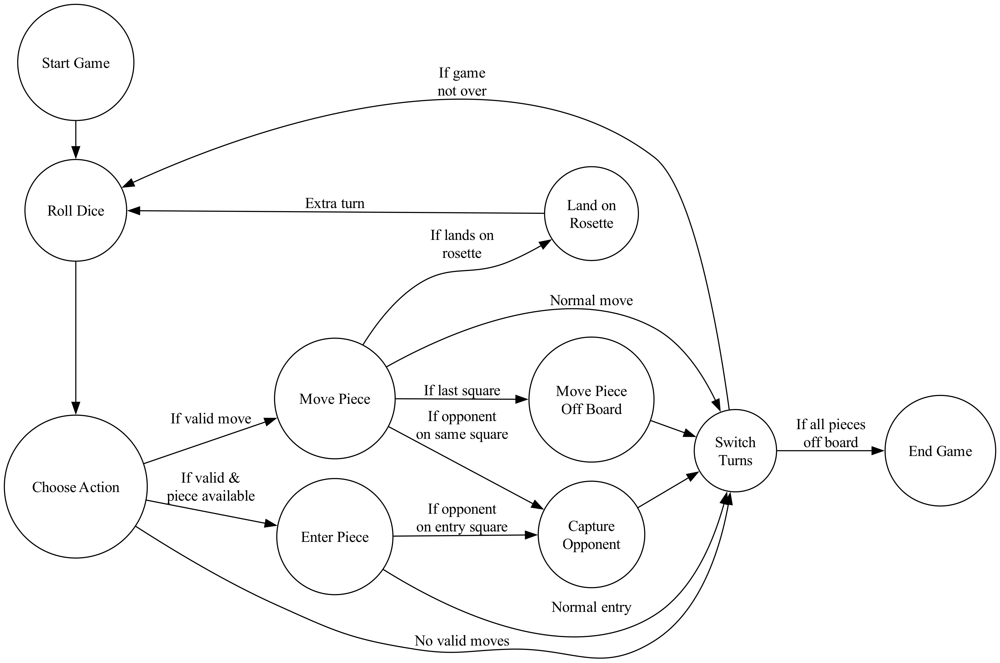

# Royal Game of Ur


## Introduction

The Royal Game of Ur, is one of the oldest known board games, dating back to around 2600 BCE. This project implements a digital version of the game.

## Features

- Implements the [Irving Finkel ruleset](./docs/rules.md)
- Command-line interface
- State machine design for game logic
- Configurable AI strategies
- Simulation mode for running multiple games with different strategies
- Cross-platform compatibility (Clojure and ClojureScript)

## Board Layout

The game board consists of 20 squares arranged in a specific pattern. The following image shows the board layout and how the squares are numbered:


## Game State Machine

The game logic follows a finite state machine design. The following diagram illustrates the different states and transitions in the game:



## AI Strategies

This project implements several AI strategies for playing the Royal Game of Ur:

1. **Minimax**: Looks ahead several moves, considering both its own opportunities and the opponent's potential responses.
2. **Monte Carlo Tree Search (MCTS)**: A probabilistic algorithm that balances exploration and exploitation to find optimal moves. (in development)
3. **Random**: Chooses moves randomly.
4. **First-in-list**: Always chooses the first available move.
5. **Strategic**: Uses a simple heuristic to prioritize moves.

For detailed explanations of how these algorithms work, please refer to the documentation:

- [AI Strategy Overview](./docs/strategies.md)
- [Minimax Algorithm](./docs/minimax.md)
- [Monte Carlo Tree Search (MCTS)](./docs/mcts.md)

## Technologies Used

This project utilizes a variety of technologies and tools:

1. [Clojure](https://clojure.org/): A dynamic, functional programming language for the JVM
2. [ClojureScript](https://clojurescript.org/): A compiler for Clojure that targets JavaScript
3. [nbb](https://github.com/babashka/nbb): A scripting environment for ClojureScript
4. [Malli](https://github.com/metosin/malli): A data-driven schema library for Clojure(Script)
5. [core.async](https://github.com/clojure/core.async): A Clojure(Script) library for asynchronous programming
8. [just](https://github.com/casey/just): A command runner for various development tasks
9. [asdf](https://asdf-vm.com/): A version manager for multiple runtime versions
10. [yarn](https://yarnpkg.com/): A package manager for JavaScript
11. [GraalVM](https://www.graalvm.org/): A high-performance JDK distribution
12. [Graphviz](https://graphviz.org/): An open-source graph visualization software

## Getting Started

### Prerequisites

This project was developed on a Mac (M1). Users on different operating systems may need to adapt these instructions to their environment.

At present the native build targets ARM64 only.

Before you begin, make sure you have the following installed:

1. **Homebrew**: Install with:
   ```
   /bin/bash -c "$(curl -fsSL https://raw.githubusercontent.com/Homebrew/install/HEAD/install.sh)"
   ```
   Follow the terminal instructions to add Homebrew to your PATH.

2. **Git**: Install with Homebrew:
   ```
   brew install git
   ```

3. **asdf**: Install with Homebrew:
   ```
   brew install asdf
   ```
   Add to your `~/.zshrc` or `~/.bash_profile`:
   ```
   echo -e "\n. $(brew --prefix asdf)/libexec/asdf.sh" >> ~/.zshrc
   ```
   Restart your terminal or run `source ~/.zshrc`.

### Installation

1. Clone the repository:
   ```
   git clone https://github.com/yourusername/royal-game-of-ur.git
   cd royal-game-of-ur
   ```

2. Initialize the project:
   ```
   just init
   ```

   This command will:
   - Set up asdf and install required plugins and versions
   - Install necessary tools (including GraalVM, Clojure, Node.js, nbb and Yarn)
   - Set up Git hooks
   - Install project dependencies
   - Perform any other necessary initialization steps

## Development

This project uses `just` as a command runner. To see all available commands, run:

```
just
```

Key commands include:

- `just run`: Run the CLI application (using nbb)
- `just run-clj`: Run the CLI application (using Clojure)
- `just test`: Run unit tests (using nbb)
- `just test-clj`: Run unit tests (using Clojure)
- `just watch`: Run unit tests and watch for changes (using nbb)
- `just fmt`: Format Clojure files
- `just sim-nbb`: Run a simulation with custom parameters (using nbb, no parallelism)
- `just sim`: Run a simulation with custom parameters (using Clojure)
- `just repl`: Start a Clojure REPL
- `just build`: Build the project (creates uberjar and native image)

To update all tools:

```
just update-tools
```

## Usage

To start a new game:

```
just run
```

This will launch the game in your terminal. Follow the on-screen instructions to play.

### Running Simulations

To run a simulation of multiple games with different strategies:

```
just sim [parameters]
```

Available parameters:
- `num-games`: Number of games to simulate
- `strategy-A`: Strategy for Player A
- `strategy-B`: Strategy for Player B
- `debug`: Enable debug mode
- `show`: Show game state
- `delay`: Delay between moves in milliseconds
- `parallel`: Number of parallel threads to use
- `validate`: Enable validation of the board after each move

Strategy-specific parameters can be set using the format `strategy-X-param=value`, where X is A or B, and param is the parameter name.

Example:
```
just sim num-games=100 strategy-A=minimax strategy-A-depth=3 strategy-B=first-in-list debug=false show=false delay=0 parallel=6 validate=false
```

This will run 1000 games with the minimax strategy (depth 3) for Player A against the 'first in list' strategy for Player B, using 4 parallel threads.

For more detailed information about available strategies and their parameters, please refer to the [Strategies Documentation](./docs/strategies.md).

### Running Simulations from Command Line

You can also run simulations directly from the command line using the built executable, this has better performance:

```
./royal-game-of-ur simulate [parameters]
```

Available parameters:
- `num-games`: Number of games to simulate
- `strategy-A`: Strategy for Player A
- `strategy-B`: Strategy for Player B
- `debug`: Enable debug mode (true/false)
- `show`: Show game state (true/false)
- `delay`: Delay between moves in milliseconds
- `parallel`: Number of parallel threads to use
- `validate`: Enable validation (true/false)

Example:

```
./royal-game-of-ur simulate num-games=1000 strategy-A=minimax strategy-A-depth=3 strategy-B=first-in-list debug=false show=false delay=0 parallel=6 validate=false
```

This will run 1000 games with the minimax strategy (depth 3) for Player A against the 'first in list' strategy for Player B, using 6 parallel threads and with validation turned off for improved performance.

## Testing

To run the test suite:

```
just test-clj
```

For continuous testing during development (using nbb):

```
just watch
```

## Building

Build the project (create uberjar and native ARM64 image):

```
just build
```

Run the built game:

```
./royal-game-of-ur
```

## Contributing

This is just a personal project for learning and fun. If you want to submit a pull request, I might look at it someday. Feel free to fork the repository or use any ideas from it in your own projects.

## License

This project is open source and available under the [MIT License](LICENSE).
