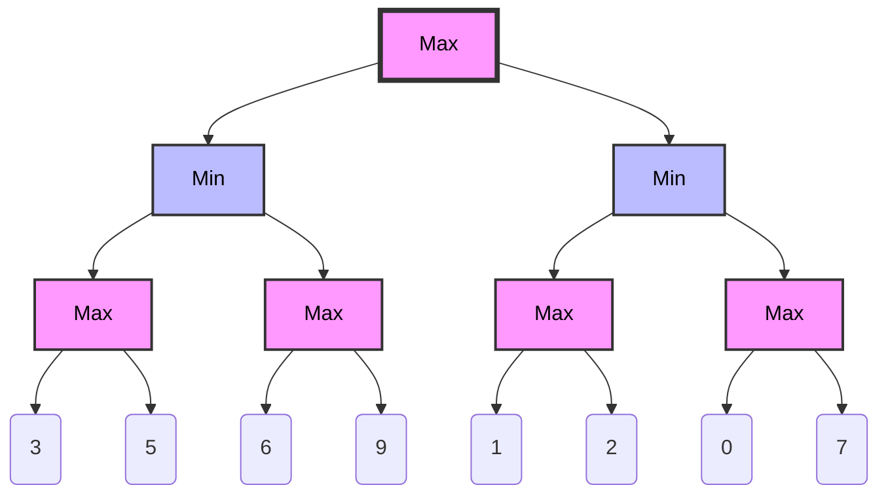
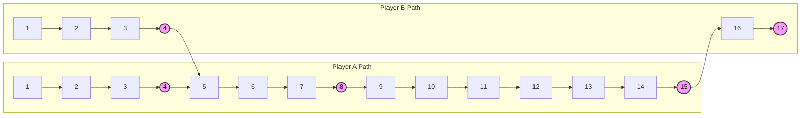
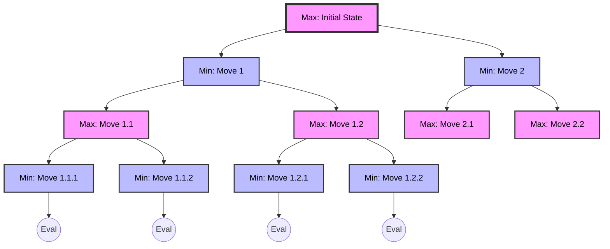
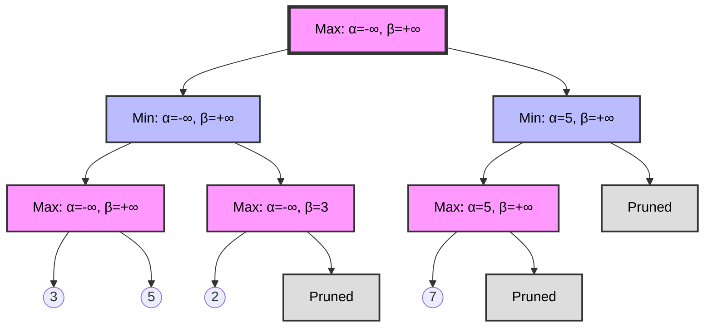

# The Minimax Algorithm

The minimax algorithm is a decision-making technique used in artificial intelligence for two-player turn-based games. It's particularly effective in games with perfect information, where both players have complete knowledge of the game state. Here we'll look at how minimax works and how it's implemented.

## What is Minimax?

Minimax is a recursive algorithm that simulates all possible moves in a game, assuming that both players play optimally. The algorithm alternates between two players:

1. The maximizing player (usually the AI) tries to maximize their score.
2. The minimizing player (usually the opponent) tries to minimize the AI's score.

The algorithm explores the game tree to a certain depth, evaluates the resulting positions, and chooses the move that leads to the best outcome assuming the opponent also plays optimally.



## Key Components of Minimax

1. **Evaluation Function**: This function assigns a score to a game state. In our implementation, it's the `evaluate-state` function.

2. **Depth Limit**: To prevent the algorithm from exploring infinitely, we set a maximum depth. In our code, it's defined by `max-depth`.

3. **Recursion**: The algorithm recursively explores possible moves, alternating between maximizing and minimizing at each level.

4. **Alpha-Beta Pruning**: An optimization technique that reduces the number of nodes evaluated in the search tree.

## Minimax in the Royal Game of Ur

Let's break down the implementation:

### Evaluation Function

```clojure
(defn- score-player [game-state player]
  (+ (* 10 (get-in game-state [:players player :off-board]))
     (count (state/get-piece-positions (:board game-state) player))))

(defn- evaluate-state [game-state]
  (let [current-player (:current-player game-state)
        opponent (state/other-player current-player)]
    (- (score-player game-state current-player)
       (score-player game-state opponent))))
```

This function evaluates the game state by considering:
- The number of pieces that have completed the board (multiplied by 10 for higher importance)
- The number of pieces on the board

It calculates this for both players and returns the difference, favoring the current player.



### The Minimax Function

```clojure
(defn- minimax [game-state depth maximizing? alpha beta]
  (if (or (zero? depth) (= :end-game (:state game-state)))
    [(evaluate-state game-state) nil]
    (let [moves (safe-get-moves game-state)
          init-score (if maximizing? (- platform/infinity) platform/infinity)
          comparator (if maximizing? > <)]
      ; ... (rest of the function)
```

This function is the core of the algorithm:

1. It first checks if we've reached the maximum depth or the end of the game. If so, it evaluates the current state.
2. If not, it gets all possible moves and initializes the best score based on whether we're maximizing or minimizing.
3. It then loops through all possible moves, recursively calling itself for each move.
4. For each move, it updates the best score and move if a better option is found.
5. It uses alpha-beta pruning to optimize the search.



### Alpha-Beta Pruning

Alpha-beta pruning is an optimization technique that significantly reduces the number of nodes evaluated in the search tree. It works by maintaining two values, alpha and beta:

- Alpha is the best value that the maximizer currently can guarantee at that level or above.
- Beta is the best value that the minimizer currently can guarantee at that level or above.

If at any point beta becomes less than or equal to alpha, the rest of that branch can be pruned because it won't influence the final decision.



### Move Selection

```clojure
(defn select-move [possible-moves game-state]
  (when (seq possible-moves)
    (second (minimax game-state max-depth true (- platform/infinity) platform/infinity))))
```

This function initiates the minimax algorithm and returns the best move found.

## Performance Considerations

While minimax with alpha-beta pruning is powerful, its performance can be further improved:

1. **Move Ordering**: By considering promising moves first, we can improve the efficiency of alpha-beta pruning[^1].
2. **Transposition Tables**: Storing and reusing evaluations of previously seen positions can prevent redundant calculations[^2].
3. **Iterative Deepening**: This technique allows the algorithm to make the best use of available time by progressively increasing the search depth[^3].

## Conclusion

The minimax algorithm with alpha-beta pruning provides an effectice way for an AI to make decisions in turn-based games. It allows the AI to look several moves ahead and choose the best possible move, considering both its own opportunities and the opponent's potential responses.

While this implementation provides a strong AI player, it's worth noting that the effectiveness of the minimax algorithm heavily depends on the accuracy of the evaluation function and the depth of the search. Deeper searches generally lead to stronger play but require more computational resources.

## Further Reading

- For a deeper dive into game theory and minimax, see "Artificial Intelligence: A Modern Approach" by Stuart Russell and Peter Norvig[^4].
- To explore more about the Royal Game of Ur and its historical context, check out Irving Finkel's work on the game[^5].

## References

[^1]: Millington, I., & Funge, J. (2009). Artificial Intelligence for Games (2nd ed.). Morgan Kaufmann Publishers.

[^2]: Schaeffer, J. (1989). The history heuristic and alpha-beta search enhancements in practice. IEEE Transactions on Pattern Analysis and Machine Intelligence, 11(11), 1203-1212.

[^3]: Korf, R. E. (1985). Depth-first iterative-deepening: An optimal admissible tree search. Artificial Intelligence, 27(1), 97-109.

[^4]: Russell, S., & Norvig, P. (2020). Artificial Intelligence: A Modern Approach (4th ed.). Pearson.

[^5]: Finkel, I. (2007). On the rules for the Royal Game of Ur. In Ancient Board Games in Perspective. British Museum Press.